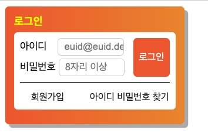

## 1.논리적순서

1.로그인 -> 2.아이디 -> 3.비밀번호 -> 4.로그인버튼 -> 5.회원가입/ 아이디 비밀번호 찾기

## 2.시멘틱마크업

로그인 -> h1
아이디,비밀번호 -> form/fildset/legend ->position:relative  
아이디 -> label/input  
비밀번호 -> label/input  
로그인버튼 -> button -> position:absolute  
 회원가입 / 아이디 비밀번호 찾기 -> float

## 3.네이밍 패턴

카멜케이스

## 4.스크린샷

