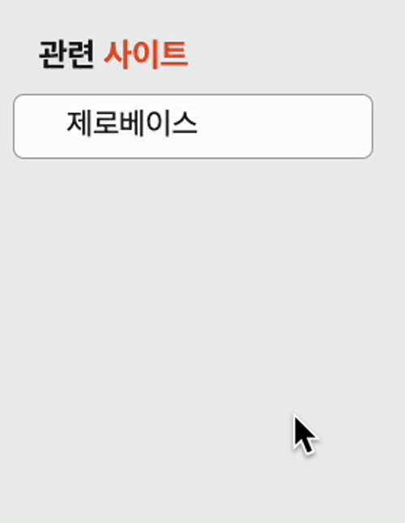

## 1.논리적순서

- 관련사이트 -> 제로베이스

## 2.시멘틱마크업

- `<html>`  
  관련사이트 h1  
  ul>li>a\*5

- `<css>`  
  ul:hover 마우스 올리면 펼쳐지게 제작  
  ul transition 0.3s / overflow:hidden  
  ul:hover li 아래로 10px 이동  
  li transition 딜레이0.3s

## 3.네이밍 패턴

- 카멜케이스 .siteList

## 4.스크린샷

